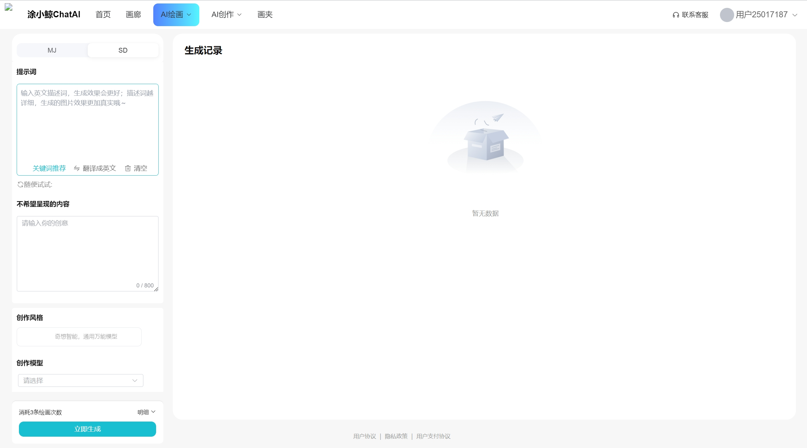
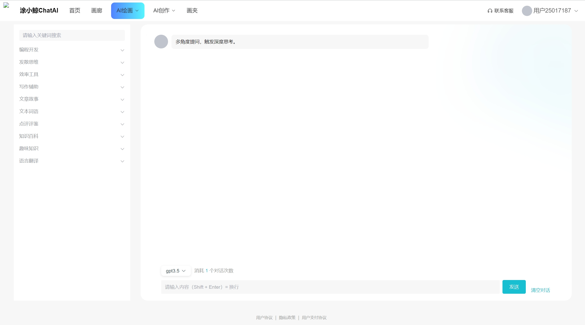
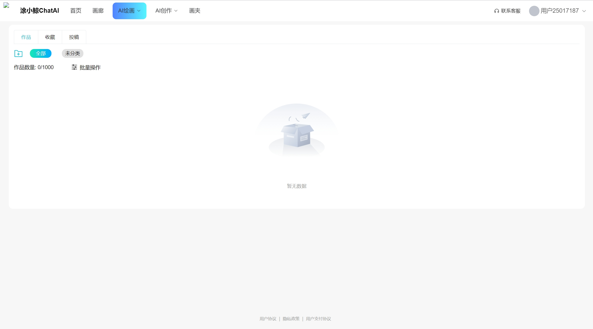
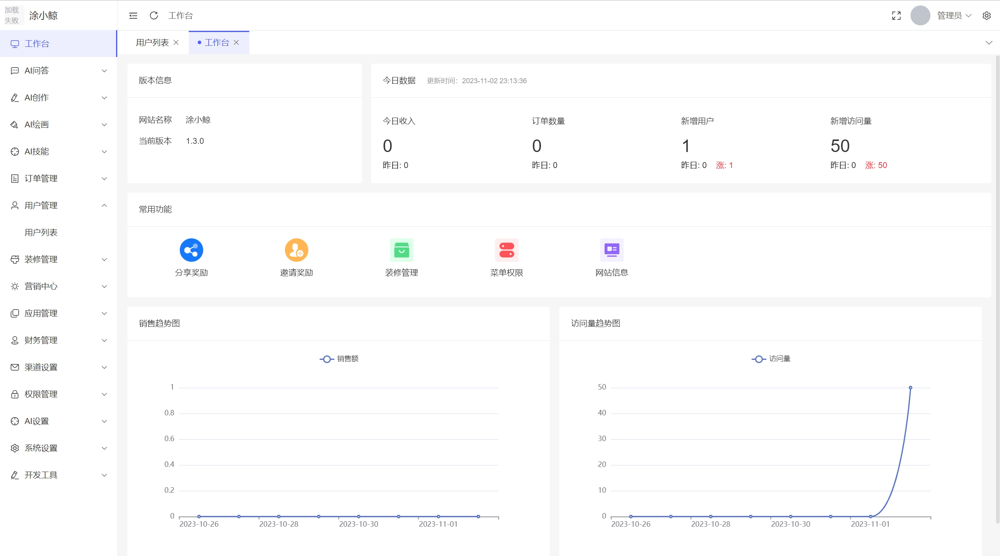
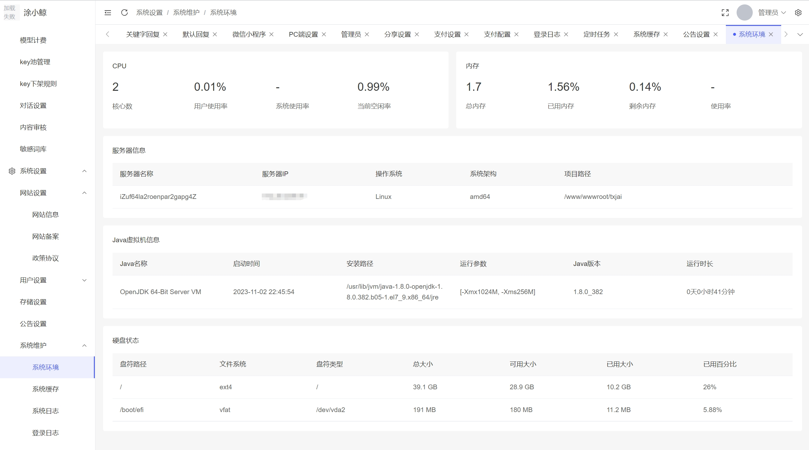
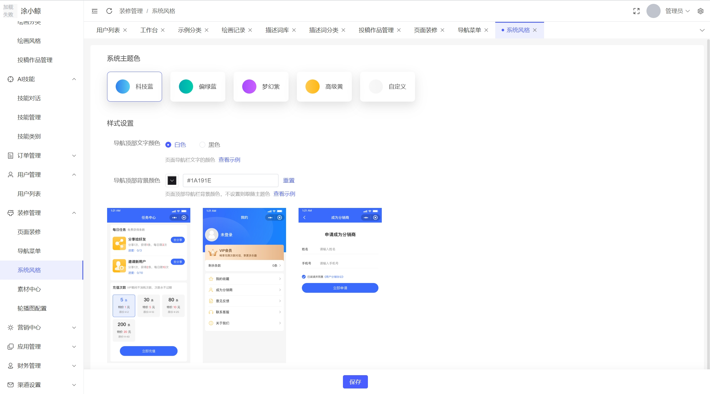
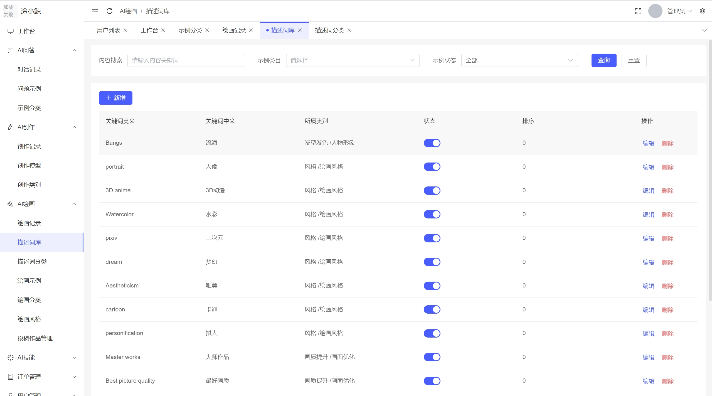

<h1 align="center">🍭 Txj-Ai</h1>

免费部署你的私人 ChatGPT+Midjourney+SD 网页应用。

## 功能支持
> 🍭 PRO版本支持更强大的功能，**宝塔10分钟部署**，配置超简单，强大的在线后台管理及配置框架让你丝滑体验，**占用内存不到100M**，**包含对话+绘画账号池支持等等**，**最低1C1G的服务器就能流畅运行**。

- [x] AI对话
- [x] AI不限数量轮询key池
- [x] Stable Diffusion `文生图` 
- [x] Stable Diffusion `风格预置` 
- [x] Stable Diffusion `快捷生图`
- [x] Stable Diffusion `本地接入` 
- [x] Midjourney `文生图` 
- [x] Midjourney `图生图` 
- [x] Midjourney `自动切图` 
- [x] 画廊展示

# 环境要求
Nginx 1.22.1

MySQL 5.7.40

Redis 7.0.11

Java tomcat7
# 部署教程
~待补充
# 用户界面预览

# 后台界面预览

